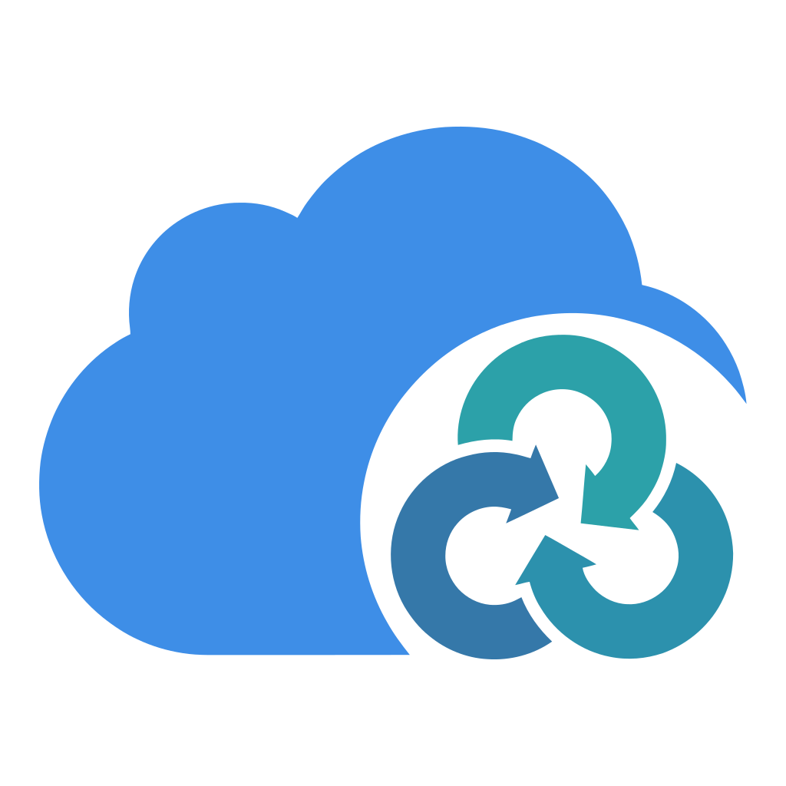

<p align="center">
  
</p>

# Rclone Cloud Sync Manager

A cloud sync management tool based on `rclone` development, designed to provide a user experience similar to "Synology Cloud Sync". Through a modern web interface, easily manage cloud storage connections, define sync tasks, and monitor sync status in real-time.

## ✨ Core Features

- **Modern Web Interface**: Clean and intuitive UI to easily manage all cloud connections and sync tasks.
- **Multi-Cloud Storage Support**: Based on powerful `rclone`, supports dozens of cloud storage services such as Google Drive, S3, OneDrive, Dropbox, etc.
- **Flexible Sync Modes**:
  - **One-way Upload**: Local -> Cloud (Suitable for backup)
  - **One-way Download**: Cloud -> Local (Suitable for fetching resources)
  - **Two-way Sync**: Keep data on both ends consistent (Suitable for multi-end collaboration)
- **Advanced Task Options**:
  - **File Filters**: Include/exclude files using powerful rclone filter patterns with **Real-time Preview**.
  - **Conflict Resolution**: Choose how to handle conflicts in bidirectional sync (Newer/Local/Remote/Both).
  - **Keep Deleted Files**: Prevent deletion of files in destination (one-way sync only).
  - **Parallel Transfers**: Configure concurrent transfer count (1-64) per task.
- **Smart Trigger Mechanism**:
  - **Real-time Sync**: Listen for file system changes and trigger sync immediately with debounce protection.
  - **Scheduled Tasks**: Support custom schedules (Cron) for automatic execution.
- **Visual Monitoring**:
  - **Real-time Progress**: View current transfer files, speed, and progress for each file with live updates.
  - **Quota Monitoring**: View cloud storage usage, remaining space, trashed space, and object count.
  - **Task History**: Detailed execution logs and result records for easy review.
  - **Detailed Logs**: File-level event logs with filtering by task, job, and log level.
- **Secure and Reliable**:
  - **Access Control**: Built-in HTTP Basic Authentication for web access.
  - **Encrypted Storage**: Sensitive configuration information is encrypted and stored in the local database.
  - **Import Configuration**: Bulk import connections from existing rclone.conf files.
## ☁️ Supported Cloud Storage

Thanks to the powerful ecosystem of Rclone, this tool supports over 40 cloud storage services, including but not limited to:

- **Public Cloud**: Google Drive, OneDrive, Dropbox, Box, pCloud
- **Object Storage**: Amazon S3 (and compatible protocols like MinIO, Aliyun OSS, Tencent Cloud COS), Backblaze B2, Wasabi
- **Standard Protocols**: WebDAV, FTP, SFTP, HTTP
- **Local/Network**: Local Disk, SMB/CIFS (Windows Sharing)

## 🚀 Installation and Running

### Method One: Download and Run Directly (Recommended)

Please go to the [Releases](https://github.com/xzzpig/rclone-sync/releases) page to download the binary file for your system.

1.  Unzip the downloaded file.
2.  Run in terminal or command line:
    ```bash
    # Linux / macOS
    ./cloud-sync serve

    # Windows
    .\cloud-sync.exe serve
    ```
3.  Open your browser and visit `http://localhost:8080` to start using it.

### Method Two: Run with Docker

The easiest way to deploy is using Docker:

```bash
docker run -d \
  --name cloud-sync \
  -p 8080:8080 \
  -v $(pwd)/app_data:/app/app_data \
  ghcr.io/xzzpig/rclone-sync
```

If you need to sync local files, make sure to mount them into the container:

```bash
docker run -d \
  --name cloud-sync \
  -p 8080:8080 \
  -v $(pwd)/app_data:/app/app_data \
  -v /your/local/sync/path:/data \
  ghcr.io/xzzpig/rclone-sync
```

### Method Three: Build from Source

If you are a developer or want to experience the latest features:

1.  **Clone Repository**:
    ```bash
    git clone https://github.com/xzzpig/rclone-sync.git
    cd rclone-sync
    ```
2.  **Build and Run**:
    ```bash
    # Requires Go 1.25+ and Node.js installed
    # Compile frontend
    cd web && pnpm install && pnpm build && cd ..
    # Compile backend
    go build -o cloud-sync ./cmd/cloud-sync
    # Run
    ./cloud-sync serve
    ```

## 📖 User Guide

### 1. Connect Cloud Storage (Connections)
When entering the system for the first time, please click the **"+"** icon in the sidebar to add a connection.
- Select your cloud storage provider (e.g., Google Drive).
- Complete the authorization process according to the wizard prompts.
- After successful authorization, you will see the connection in the sidebar and can browse the files inside.
- **Import Configuration**: You can also bulk import connections from an existing rclone.conf file using the import wizard.
- **File Browser**: Browse both local and remote file systems to select paths for sync tasks.

### 2. Create Sync Task (Tasks)
On the connection details page, click the **"New Task"** button.
- **Local Path**: Select the folder on your computer that needs to be synced.
- **Remote Path**: Select the folder in the cloud.
- **Sync Direction**:
    - **Upload**: Only push local changes to the cloud.
    - **Download**: Only pull cloud changes to the local.
    - **Bidirectional**: Keep both ends consistent; modifications on either end will sync to the other.
- **Conflict Resolution** (for bidirectional sync):
    - **Newer**: Keep the newer file, rename the older one.
    - **Local**: Keep the local file, delete the remote one.
    - **Remote**: Keep the remote file, delete the local one.
    - **Both**: Keep both files, add conflict suffix to the older one.
- **Filters**: Add Include/Exclude rules to filter files using rclone filter syntax. Rules are matched in order, first match wins. Examples:
  ```
  - node_modules/**     # Exclude node_modules directory
  - .git/**             # Exclude .git directory
  - *.tmp               # Exclude all .tmp files
  + **                  # Include everything else
  ```
  Click **"Preview"** to see which files will be affected before saving.
- **Trigger Method**:
    - **Manual**: Sync only when you click "Run".
    - **Schedule**: Set scheduled tasks (e.g., "2 AM every day").
    - **Real-time**: When enabled, automatically starts syncing when files change (with a short delay to optimize performance).

### 3. Monitoring and Logs
- **Dashboard**: In the task list, you can intuitively see the current status of each task (Idle, Syncing, Error).
- **Task Details**: Click the task card to view detailed transfer speed, remaining file count, and historical run logs.
- **Active Transfers**: View currently transferring files with real-time progress updates.
- **Storage Quota**: Monitor cloud storage usage including used space, free space, trashed files, and object count.
- **History**: The system retains recent sync logs for easy troubleshooting of file transfer issues.
- **Detailed Logs**: View file-level event logs (UPLOAD/DOWNLOAD/DELETE/MOVE/ERROR) with filtering by task, job, and log level (INFO/WARNING/ERROR).

## ❓ Frequently Asked Questions (FAQ)

**Q: Is real-time sync immediate?**
A: To avoid frequent triggers, the system has a "debounce" delay of a few seconds. Sync will start a few seconds after you stop modifying files.

**Q: Where is the configuration file stored?**
A: By default, data is stored in the `app_data` folder in the program's running directory. You can modify this using the `--data-dir` parameter.

**Q: How do I reset the administrator password?**
A: The current version defaults to no login authentication (suitable for personal local use). If you need to deploy on the public network, please use Nginx or other reverse proxies for authentication protection.

**Q: Can I import existing rclone configurations?**
A: Yes! You can use the import wizard to bulk import connections from your existing rclone.conf file. The wizard will parse the configuration, let you preview and edit connections, and then import them into the database.

**Q: How does the log cleanup work?**
A: The system automatically cleans up old log records based on the `max_logs_per_connection` setting. The cleanup task runs according to the `cleanup_schedule` cron expression (default: every hour). Oldest logs are deleted first (FIFO). Set to 0 to disable cleanup.

**Q: What is the "auto_delete_empty_jobs" option?**
A: When enabled, jobs with no activity (no files transferred, no deletions, no errors, and successful status) are automatically deleted. Failed jobs are always retained for debugging.

## ⚙️ Configuration Instructions

The program reads the `config.toml` file in the current directory by default when starting. You can also specify other paths using the command line parameter `--config`.

Here is a complete configuration example and description:

```toml
[app]
# Operating environment: "development" or "production"
# In production mode, some debugging functions are disabled, and logs are more concise
environment = "production"

# Data storage directory
# Used to store database files, log files, etc.
# Default value: "./app_data"
data_dir = "./app_data"

[server]
# Listening address
# 0.0.0.0 allows LAN/Public access
# 127.0.0.1 allows localhost access only
host = "0.0.0.0"

# Listening port
port = 8080

[log]
# Log level: "debug", "info", "warn", "error"
# "info" is recommended for production environments
level = "info"

# Hierarchical log levels by module name
# Names are case-sensitive, separated by "."
# Example: "core.db" matches "core.db", "core.db.query", etc.
[log.levels]
# "core.db" = "debug"        # core.db and sub-modules use debug level
# "core.scheduler" = "warn"  # core.scheduler uses warn level
# "rclone" = "error"         # rclone module uses error level

[app.job]
# Maximum number of logs retained per connection
# 0 = unlimited (no cleanup)
# Default: 1000
max_logs_per_connection = 1000

# Cron expression for log cleanup task
# Format: minute hour day month weekday
# Default: "0 * * * *" (every hour)
cleanup_schedule = "0 * * * *"

# Automatically delete empty jobs (no activity)
# Empty job criteria: filesTransferred=0, bytesTransferred=0, filesDeleted=0, errorCount=0, status=SUCCESS
# Failed jobs are retained even if empty
# Default: true
# auto_delete_empty_jobs = false

[app.sync]
# Global default parallel transfer count
# Range: 1-64
# Default: 4
transfers = 4

[database]
# Database migration mode
# "auto": Automatic migration (Suitable for development or simple upgrades)
# "versioned": Versioned migration (Suitable for production environments, safer)
migration_mode = "versioned"

# Database file path (Relative to data_dir)
# Default value: "cloud-sync.db"
path = "cloud-sync.db"

[security]
# Encryption key for sensitive data in database, such as cloud storage credentials
# Leave empty to disable encryption (not recommended for production)
encryption_key = ""

[auth]
# HTTP Basic Auth credentials
# When both username and password are set, all API and UI access (except /health) will require authentication
# Can also be set via environment variables: CLOUDSYNC_AUTH_USERNAME and CLOUDSYNC_AUTH_PASSWORD
# Leave both empty to disable authentication (default, for personal local use)
# username = "admin"
# password = "your-secure-password"
```

### HTTP Basic Authentication

To enable HTTP Basic Auth, add the following configuration to your `config.toml`:

```toml
[auth]
username = "admin"
password = "your-secure-password"
```

Or use environment variables:

```bash
export CLOUDSYNC_AUTH_USERNAME=admin
export CLOUDSYNC_AUTH_PASSWORD=your-secure-password
```

Once enabled, accessing any page (except `/health`) will prompt for HTTP Basic Auth credentials.

**Security Recommendations:**

1. **Use HTTPS**: HTTP Basic Auth transmits credentials in Base64 encoding. Always use HTTPS in production to protect transmission security.
2. **Use a Reverse Proxy**: In production, use Nginx/Caddy or other reverse proxies for TLS termination.
3. **Protect Configuration File**: The password in the config file is in plain text. Ensure the config file permissions are set to `600`.
4. **Strong Password**: Use complex passwords and avoid default or simple passwords.

### Environment Variables

Configuration can also be set via environment variables with the prefix `CLOUDSYNC_`. Nested fields use `_` as a separator.

Examples:
- `CLOUDSYNC_SERVER_PORT=9090`
- `CLOUDSYNC_SERVER_HOST=0.0.0.0`
- `CLOUDSYNC_APP_DATA_DIR=/data`
- `CLOUDSYNC_APP_ENVIRONMENT=production`
- `CLOUDSYNC_LOG_LEVEL=debug`
- `CLOUDSYNC_DATABASE_PATH=/data/sync.db`
- `CLOUDSYNC_SECURITY_ENCRYPTION_KEY=your-encryption-key`
- `CLOUDSYNC_AUTH_USERNAME=admin`
- `CLOUDSYNC_AUTH_PASSWORD=your-secure-password`
- `CLOUDSYNC_APP_SYNC_TRANSFERS=8`

### Command Line Parameters

In addition to the configuration file, you can also override some settings via command line parameters:

- `--config`: Specify configuration file path (Default: `config.toml`)
- `--data-dir`: Specify data storage directory (Overrides `app.data_dir` in config file)
- `--port`: Specify listening port (Overrides `server.port` in config file)
- `--host`: Specify listening host address (Overrides `server.host` in config file)
- `--log-level`: Set log level (Overrides `log.level` in config file)
- `--help`: View all available parameters

### Hierarchical Log Levels

You can set different log levels for specific modules to fine-tune logging output:

```toml
[log.levels]
# Set debug level for database operations
"core.db" = "debug"

# Set warning level for scheduler
"core.scheduler" = "warn"

# Set error level for rclone operations
"rclone" = "error"

# Set debug level for GraphQL resolver
"api.graphql" = "debug"
```

**Matching Rules:**
- Module names are case-sensitive
- A pattern matches itself and all sub-modules
- Example: `"core.db"` matches `core.db`, `core.db.query`, `core.db.migrate`, etc.
- The first matching pattern wins (top-down order in config file)

**Common Module Names:**
- `core.db` - Database operations
- `core.scheduler` - Task scheduling
- `core.runner` - Task execution
- `core.watcher` - File system watching
- `rclone` - Rclone operations
- `api` - HTTP API
- `api.graphql` - GraphQL resolver

## 📄 License

MIT License
