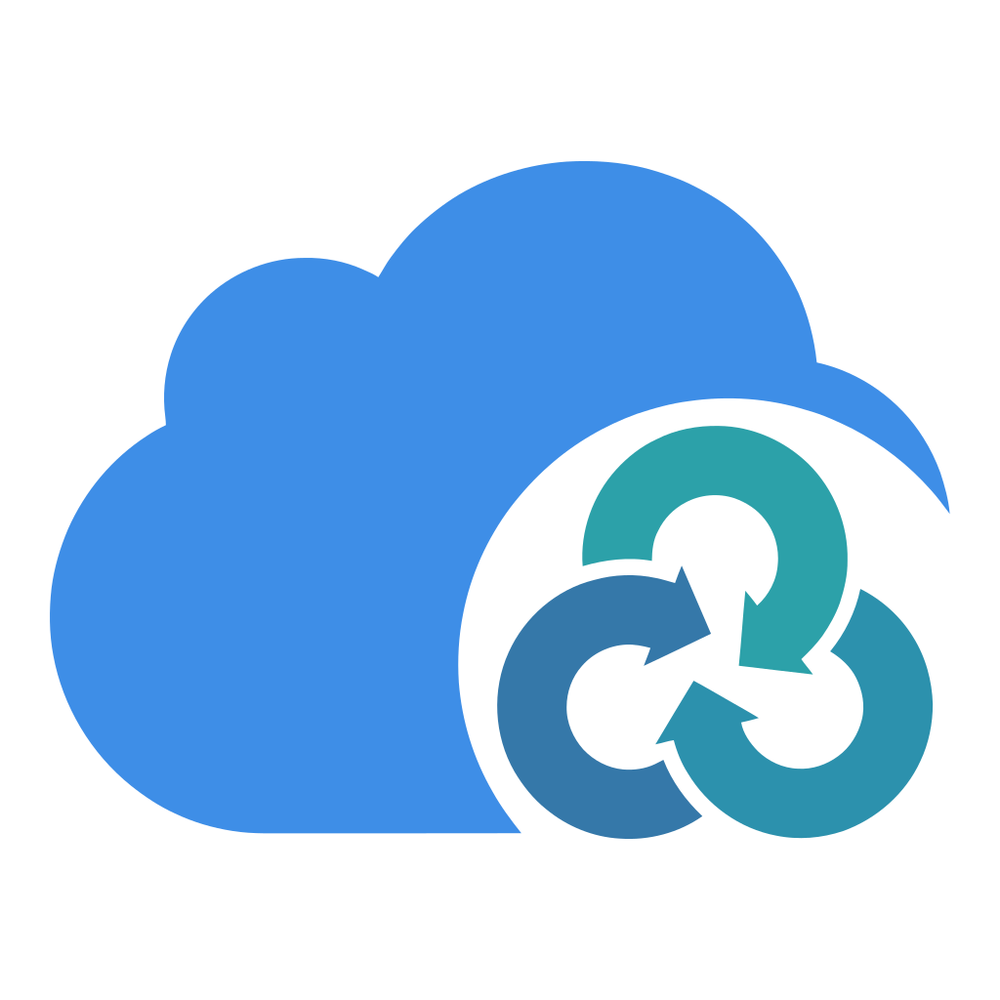

<p align="center">
  
</p>

# Rclone Cloud Sync Manager

一个基于 `rclone` 二次开发的云同步管理工具，旨在提供类似 "群晖 Cloud Sync" 的用户体验。通过现代化的 Web 界面，轻松管理云存储连接、定义同步任务，并实时监控同步状态。

## ✨ 核心特性

- **现代化 Web 界面**: 简洁直观的 UI，轻松管理所有云连接和同步任务。
- **多云存储支持**: 基于强大的 `rclone`，支持 Google Drive, S3, OneDrive, Dropbox 等数十种云存储服务。
- **灵活的同步模式**:
  - **单向上传**: 本地 -> 云端 (适合备份)
  - **单向下载**: 云端 -> 本地 (适合拉取资源)
  - **双向同步**: 保持两端数据一致 (适合多端协作)
- **高级任务选项**:
  - **文件过滤器**: 使用强大的 rclone 过滤规则，支持 **实时预览** 过滤效果。
  - **冲突解决策略**: 双向同步时选择如何处理冲突（保留较新/本地/远程/两者）。
  - **保留删除文件**: 防止删除目标端的文件（仅单向同步模式）。
  - **并行传输数量**: 为每个任务单独配置并发传输数量 (1-64)。
- **智能触发机制**:
  - **实时同步**: 监听文件系统变动，即时触发同步（带防抖保护）。
  - **计划任务**: 支持自定义时间表 (Cron)，按计划自动执行。
- **性能加速**:
  - **元数据缓存**: 缓存目录列表以加速大文件夹（10万+文件）的同步，显著降低同步开销。
  - **变更通知支持**: 通过实时变更事件自动更新缓存（支持 OneDrive, Google Drive, Dropbox, Box）。
  - **灵活配置**: 可在界面中为每个连接独立开启，并支持自定义缓存过期时间和轮询间隔。
- **可视化监控**:
  - **实时进度**: 实时查看当前传输的每个文件、速度及详细进度。
  - **配额监控**: 查看云存储的已用空间、剩余总量、回收站占用和对象数量。
  - **任务历史**: 详细的执行日志和结果记录，随时回溯。
  - **详细日志**: 文件级事件日志，支持按任务、作业和日志级别过滤。
- **安全可靠**:
  - **访问控制**: 内置 HTTP Basic 认证，保障 Web 访问安全。
  - **加密存储**: 敏感配置信息（如密钥）加密存储于本地数据库。
  - **配置导入**: 支持从现有 rclone.conf 批量导入连接配置。
- **事件钩子 (Task Event Hooks)**:
  - **HTTP 钩子**: 任务开始、完成或失败时向外部服务发送 HTTP 请求。
  - **命令钩子**: 执行本地 Shell 命令/脚本，实现自定义自动化、邮件通知或触发下游任务。
  - **模板支持**: 使用 Go text/template 语法，提供任务上下文数据和辅助函数（FormatTime、FormatDuration、FormatSizeBytes 等）。
  - **错误处理**: 配置每个 Hook 的错误处理行为（忽略、取消、致命）。
  - **优先级排序**: 多个 Hook 按优先级顺序执行，支持任务级和连接级钩子。
- **国际化支持**: 原生支持 **简体中文** 和 **English** 界面。
- **跨平台**: 支持 Linux, Windows, macOS 以及 Docker。

## ☁️ 支持的云存储

得益于 Rclone 的强大生态，本工具支持超过 40 种云存储服务，包括但不限于：

- **公有云**: Google Drive, OneDrive, Dropbox, Box, pCloud
- **对象存储**: Amazon S3 (及兼容协议如 MinIO, 阿里云 OSS, 腾讯云 COS), Backblaze B2, Wasabi
- **标准协议**: WebDAV, FTP, SFTP, HTTP
- **本地/网络**: 本地磁盘, SMB/CIFS (Windows 共享)

## 🚀 安装与运行

### 方式一：直接下载运行 (推荐)

请前往 [Releases](https://github.com/xzzpig/rclone-sync/releases) 页面下载对应您系统的二进制文件。

1.  解压下载的文件。
2.  在终端或命令行中运行：
    ```bash
    # Linux / macOS
    ./rclone-sync serve

    # Windows
    .\rclone-sync.exe serve
    ```
3.  打开浏览器访问 `http://localhost:8080` 即可开始使用。

### 方式二：使用 Docker 运行

最简单的部署方式是使用 Docker：

```bash
docker run -d \
  --name rclone-sync \
  -p 8080:8080 \
  -v $(pwd)/rclone-sync.db:/app/rclone-sync.db \
  -v $(pwd)/app_data:/app/app_data \
  ghcr.io/xzzpig/rclone-sync
```

> **重要**: 必须映射 `rclone-sync.db`（数据库文件）和 `app_data`（同步状态目录），否则容器重启后数据会丢失。

如果您需要自定义配置（如启用认证、加密密钥等），请映射配置文件：

```bash
docker run -d \
  --name rclone-sync \
  -p 8080:8080 \
  -v $(pwd)/config.toml:/app/config.toml \
  -v $(pwd)/rclone-sync.db:/app/rclone-sync.db \
  -v $(pwd)/app_data:/app/app_data \
  ghcr.io/xzzpig/rclone-sync
```

如果您需要同步本地文件，请确保将其挂载到容器中：

```bash
docker run -d \
  --name rclone-sync \
  -p 8080:8080 \
  -v $(pwd)/config.toml:/app/config.toml \
  -v $(pwd)/rclone-sync.db:/app/rclone-sync.db \
  -v $(pwd)/app_data:/app/app_data \
  -v /您的本地同步路径:/data \
  ghcr.io/xzzpig/rclone-sync
```

### 方式三：从源码构建

如果您是开发者或希望体验最新功能：

1.  **克隆仓库**:
    ```bash
    git clone https://github.com/xzzpig/rclone-sync.git
    cd rclone-sync
    ```
2.  **构建并运行**:
    ```bash
    # 需要安装 Go 1.25+ 和 Node.js
    # 编译前端
    cd web && pnpm install && pnpm build && cd ..
    # 编译后端
    go build -o rclone-sync ./cmd/rclone-sync
    # 运行
    ./rclone-sync serve
    ```

## 📖 使用指南

### 1. 连接云存储 (Connections)
首次进入系统，请点击侧边栏的 **"+"** 号添加连接。
- 选择您的云存储提供商（如 Google Drive）。
- 根据向导提示完成授权流程。
- 授权成功后，您可以在侧边栏看到该连接，并浏览其中的文件。
- **导入配置**: 您也可以使用导入向导从现有的 rclone.conf 文件批量导入连接配置。
- **文件浏览器**: 浏览本地和远程文件系统，为同步任务选择路径。

### 2. 创建同步任务 (Tasks)
在连接详情页，点击 **"新建任务"** 按钮。
- **本地路径**: 选择您电脑上需要同步的文件夹。
- **远程路径**: 选择云端的文件夹。
- **同步方向**:
    - **上传**: 仅将本地修改推送到云端。
    - **下载**: 仅将云端修改拉取到本地。
    - **双向**: 两端保持一致，任何一端的修改都会同步到另一端。
- **冲突解决策略**（双向同步模式）:
    - **保留较新**: 保留较新的文件，重命名较旧的文件。
    - **保留本地**: 保留本地文件，删除远程文件。
    - **保留远程**: 保留远程文件，删除本地文件。
    - **两者保留**: 保留两个文件，给较旧的文件添加冲突后缀。
- **过滤器**: 使用 rclone 过滤语法添加包含/排除规则。规则按顺序匹配，第一个匹配的规则生效。示例：
  ```
  - node_modules/**     # 排除 node_modules 目录
  - .git/**             # 排除 .git 目录
  - *.tmp               # 排除所有 .tmp 文件
  + **                  # 包含其他所有文件
  ```
  保存前可点击 **"预览"** 查看受影响的文件。
- **触发方式**:
    - **手动**: 仅在您点击"运行"时同步。
    - **计划**: 设置定时任务（如"每天凌晨2点"）。
    - **实时**: 开启后，文件发生变化时自动开始同步（有短暂延迟以优化性能）。

### 3. 监控与日志
- **仪表盘**: 在任务列表中，您可以直观地看到每个任务的当前状态（空闲、同步中、错误）。
- **任务详情**: 点击任务卡片，查看详细的传输速度、剩余文件数以及历史运行日志。
- **活跃传输**: 查看当前正在传输的文件列表，实时更新传输进度。
- **存储配额**: 监控云存储使用情况，包括已用空间、可用空间、回收站占用和对象数量。
- **历史记录**: 系统会保留最近的同步日志，方便您排查文件传输问题。
- **详细日志**: 查看文件级事件日志（上传/下载/删除/移动/错误/HOOK），支持按任务、作业和日志级别（信息/警告/错误）过滤。

### 4. 配置任务事件钩子 (Task Event Hooks)
钩子允许您在任务到达某些生命周期事件时执行自定义操作。在任务设置或连接设置页面中配置钩子。

- **事件类型**:
    - **On Start (开始)**: 任务开始执行前触发。
    - **On Success (成功)**: 任务成功完成后触发。
    - **On Failure (失败)**: 任务失败后触发。
    - **On End (结束)**: 任务结束后触发（无论成功或失败，总是最后触发）。

- **钩子类型**:
    - **HTTP 钩子**: 向外部 URL 发送 HTTP 请求（GET/POST/PUT）。
      - 可配置 URL、HTTP 方法、自定义请求头和请求体。
      - 所有字段均支持 Go text/template 语法，可使用任务上下文数据。
    - **命令钩子**: 在服务器上执行 Shell 命令。
      - 可配置命令内容、工作目录和超时时间。
      - 任务上下文通过环境变量传递给命令。

- **模板变量**: 在 HTTP 钩子的 URL、请求头、请求体以及命令钩子的命令中可用：
    - `{{.Task.Name}}` - 任务名称
    - `{{.Task.ID}}` - 任务 UUID
    - `{{.Job.ID}}` - 作业 UUID
    - `{{.Job.Status}}` - 作业状态
    - `{{.Event}}` - 事件类型 (on_start/on_success/on_failure/on_end)
    - `{{.Error}}` - 错误信息（如果有）
    - `{{.Duration}}` - 执行耗时
    - `{{.Stats.FilesTransferred}}` - 传输文件数
    - `{{.Stats.BytesTransferred}}` - 传输字节数
    - `{{.Env.VAR_NAME}}` - 访问环境变量

- **模板函数**:
    - `{{FormatTime .Job.StartTime}}` - 格式化时间为 RFC3339
    - `{{FormatDuration .Duration}}` - 人类可读的时长
    - `{{FormatSizeBytes .Stats.BytesTransferred}}` - 人类可读的大小
    - `{{JsonMarshal .Stats}}` - 转换为 JSON

- **错误处理**（每个钩子独立配置）:
    - **忽略** (默认): 钩子失败时继续执行后续钩子。
    - **取消**: 停止任务，将作业标记为 CANCELLED，仅触发 on_end 钩子。
    - **致命**: 停止任务，将作业标记为 FAILED，依次触发 on_failure 和 on_end 钩子。

- **示例: Slack 通知** (HTTP 钩子, POST):
  ```json
  {
    "text": "任务 *{{.Task.Name}}* {{.Event}}: {{.Job.Status}}\n耗时: {{FormatDuration .Duration}}\n文件数: {{.Stats.FilesTransferred}}"
  }
  ```

- **示例: 钉钉通知** (HTTP 钩子, POST):
  ```json
  {
    "msgtype": "markdown",
    "markdown": {
      "title": "同步{{if eq .Event \"on_success\"}}成功{{else}}失败{{end}}",
      "text": "### {{.Task.Name}}\n- 状态: {{.Job.Status}}\n- 耗时: {{FormatDuration .Duration}}\n- 文件数: {{.Stats.FilesTransferred}}"
    }
  }
  ```

- **命令钩子环境变量**:
  | 变量名 | 说明 |
  |--------|------|
  | `RCLONE_SYNC_TASK_ID` | 任务 UUID |
  | `RCLONE_SYNC_TASK_NAME` | 任务名称 |
  | `RCLONE_SYNC_JOB_ID` | 作业 UUID |
  | `RCLONE_SYNC_EVENT` | 事件类型 |
  | `RCLONE_SYNC_STATUS` | 作业状态 |
  | `RCLONE_SYNC_ERROR` | 错误信息 |
  | `RCLONE_SYNC_FILES_TRANSFERRED` | 传输文件数 |
  | `RCLONE_SYNC_BYTES_TRANSFERRED` | 传输字节数 |
  | `RCLONE_SYNC_DURATION_SECONDS` | 执行耗时（秒） |

## ❓ 常见问题 (FAQ)

**Q: 实时同步是立即发生的吗？**
A: 为了避免频繁触发，系统会有几秒钟的"防抖"延迟。当您停止修改文件几秒后，同步才会开始。

**Q: 配置文件存储在哪里？**
A: 默认情况下，数据存储在程序运行目录下的 `app_data` 文件夹中。您可以通过 `--data-dir` 参数修改。

**Q: 如何重置管理员密码？**
A: 目前版本默认无登录认证（适合个人本地使用）。如需部署在公网，请配合 Nginx 等反向代理进行认证保护。

**Q: 是否可以导入现有的 rclone 配置？**
A: 可以！您可以使用导入向导从现有的 rclone.conf 文件批量导入连接配置。向导会解析配置文件，让您预览和编辑连接，然后导入到数据库中。

**Q: 日志清理是如何工作的？**
A: 系统会根据 `max_logs_per_connection` 设置自动清理旧的日志记录。清理任务按照 `cleanup_schedule` cron 表达式运行（默认：每小时）。最旧的日志优先被删除（FIFO）。设置为 0 可禁用清理。

**Q: "auto_delete_empty_jobs" 选项是什么？**
A: 启用后，无活动的作业（没有文件传输、没有删除、没有错误且状态为成功）会被自动删除。失败的作业始终保留用于调试。

## ⚙️ 配置说明

程序启动时会默认读取当前目录下的 `config.toml` 文件。您也可以通过命令行参数 `--config` 指定其他路径。

以下是完整的配置示例及说明：

```toml
[app]
# 运行环境: "development" (开发) 或 "production" (生产)
# 生产模式下会禁用部分调试功能，日志更精简
environment = "production"

# 数据存储目录
# 用于存放数据库文件、日志文件等
# 默认值: "./app_data"
data_dir = "./app_data"

[server]
# 监听地址
# 0.0.0.0 表示允许局域网/公网访问
# 127.0.0.1 表示仅允许本机访问
host = "0.0.0.0"

# 监听端口
port = 8080

[log]
# 日志级别: "debug", "info", "warn", "error"
# 生产环境建议使用 "info"
level = "info"

# 按模块名称设置层级日志级别
# 名称区分大小写，以 "." 分隔
# 示例: "core.db" 匹配 "core.db", "core.db.query" 等
[log.levels]
# "core.db" = "debug"        # core.db 及其子模块使用 debug 级别
# "core.scheduler" = "warn"  # core.scheduler 使用 warn 级别
# "rclone" = "error"         # rclone 模块使用 error 级别

[app.job]
# 每个连接保留的最大日志条数
# 0 = 无限制（不清理）
# 默认值: 1000
max_logs_per_connection = 1000

# 日志清理任务的 cron 表达式
# 格式: 分 时 日 月 周
# 默认值: "0 * * * *" (每小时整点)
cleanup_schedule = "0 * * * *"

# 自动删除无活动作业
# 无活动判定: filesTransferred=0, bytesTransferred=0, filesDeleted=0, errorCount=0, status=SUCCESS
# 失败的作业即使无活动也会保留
# 默认值: true
# auto_delete_empty_jobs = false

[app.sync]
# 全局默认并行传输数量
# 范围: 1-64
# 默认值: 4
transfers = 4

[app.hook]
# 全局启用或禁用钩子功能
# 禁用时，所有钩子将不会执行，钩子界面将被隐藏
# 默认值: true
enabled = true

# 钩子执行的默认超时时间（秒）
# 单个钩子可以覆盖此值
# 默认值: 30
default_timeout = 30

[database]
# 数据库迁移模式
# "auto": 自动迁移 (适合开发或简单升级)
# "versioned": 版本化迁移 (适合生产环境，更安全)
migration_mode = "versioned"

# 数据库文件路径 (相对于 data_dir)
# 默认值: "rclone-sync.db"
path = "rclone-sync.db"

[security]
# 数据库敏感数据加密密钥，如云存储凭据
# 留空则不加密 (不建议在生产环境使用)
encryption_key = ""

[auth]
# HTTP Basic Auth 认证凭据
# 当同时设置用户名和密码时，所有 API 和 UI 访问（除 /health 外）都需要认证
# 也可以通过环境变量设置：RCLONESYNC_AUTH_USERNAME 和 RCLONESYNC_AUTH_PASSWORD
# 两者都留空则禁用认证（默认，适合个人本地使用）
# username = "admin"
# password = "your-secure-password"
```

### HTTP Basic 认证

要启用 HTTP Basic Auth，请在 `config.toml` 中添加以下配置：

```toml
[auth]
username = "admin"
password = "your-secure-password"
```

或使用环境变量：

```bash
export RCLONESYNC_AUTH_USERNAME=admin
export RCLONESYNC_AUTH_PASSWORD=your-secure-password
```

启用后，访问任何页面（除 `/health` 外）都将提示输入 HTTP Basic Auth 凭据。

**安全建议：**

1. **使用 HTTPS**：HTTP Basic Auth 以 Base64 编码传输凭据。在生产环境中始终使用 HTTPS 保护传输安全。
2. **使用反向代理**：在生产环境使用 Nginx/Caddy 等反向代理进行 TLS 终止。
3. **保护配置文件**：配置文件中的密码为明文，请确保配置文件权限为 `600`。
4. **强密码**：使用复杂密码，避免使用默认或简单密码。

### 环境变量

配置也可以通过环境变量设置，前缀为 `RCLONESYNC_`。嵌套字段使用 `_` 分隔。

示例:
- `RCLONESYNC_SERVER_PORT=9090`
- `RCLONESYNC_SERVER_HOST=0.0.0.0`
- `RCLONESYNC_APP_DATA_DIR=/data`
- `RCLONESYNC_APP_ENVIRONMENT=production`
- `RCLONESYNC_LOG_LEVEL=debug`
- `RCLONESYNC_DATABASE_PATH=/data/sync.db`
- `RCLONESYNC_SECURITY_ENCRYPTION_KEY=your-encryption-key`
- `RCLONESYNC_AUTH_USERNAME=admin`
- `RCLONESYNC_AUTH_PASSWORD=your-secure-password`
- `RCLONESYNC_APP_SYNC_TRANSFERS=8`
- `RCLONESYNC_APP_HOOK_ENABLED=true`
- `RCLONESYNC_APP_HOOK_DEFAULT_TIMEOUT=30`

### 命令行参数

除了配置文件，您还可以通过命令行参数覆盖部分设置：

- `--config`: 指定配置文件路径 (默认: `config.toml`)
- `--data-dir`: 指定数据存储目录 (覆盖配置文件中的 `app.data_dir` 设置)
- `--port`: 指定监听端口 (覆盖配置文件中的 `server.port` 设置)
- `--host`: 指定监听主机地址 (覆盖配置文件中的 `server.host` 设置)
- `--log-level`: 设置日志级别 (覆盖配置文件中的 `log.level` 设置)
- `--help`: 查看所有可用参数

### 层级日志级别

您可以为特定模块设置不同的日志级别，以精细控制日志输出：

```toml
[log.levels]
# 为数据库操作设置 debug 级别
"core.db" = "debug"

# 为调度器设置 warning 级别
"core.scheduler" = "warn"

# 为 rclone 操作设置 error 级别
"rclone" = "error"

# 为 GraphQL 解析器设置 debug 级别
"api.graphql" = "debug"
```

**匹配规则：**
- 模块名称区分大小写
- 一个模式匹配自身和所有子模块
- 示例：`"core.db"` 匹配 `core.db`, `core.db.query`, `core.db.migrate` 等
- 第一个匹配的模式生效（配置文件中从上到下）

**常见模块名称：**
- `core.db` - 数据库操作
- `core.scheduler` - 任务调度
- `core.runner` - 任务执行
- `core.watcher` - 文件系统监听
- `rclone` - Rclone 操作
- `api` - HTTP API
- `api.graphql` - GraphQL 解析器

## 📄 许可证

MIT License
